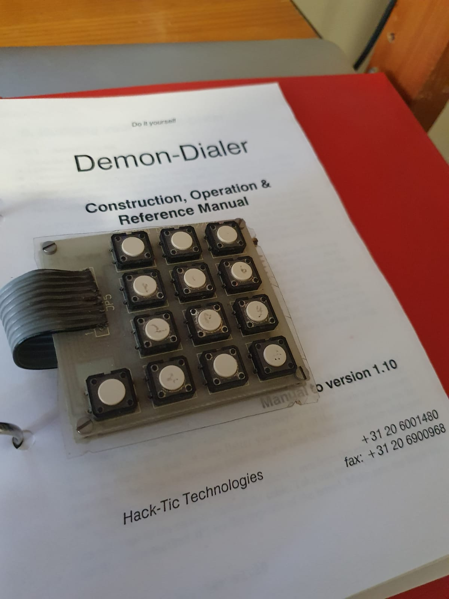

# The Hacktic Demon Dialer.

The Hacktic Demon Dialer is a compact inband signalling device, aka a blue box. With many additional features.
The DemonDialer was designed by Hacktic in 1991, see [hacktic 14-15](https://www.hacktic.nl/magazine/1448.htm)

| cpu  | keypad  |
| ---- | ------- |
|      |    |

With thanks to Don Froula, he got me looking for these files on old backup disks.
Most of the pictures are by Don.

Below is the list of files recovered, this includes full source code in assembler, scanned and converted manuals, and several photos.

| filename                                                       | description                                                      |
| -------------------------------------------------------------- | ---------------------------------------------------------------- |
| [`README.md`](README.md)                                       | this file                                                        |
| [`DEMON131.S19`](DEMON131.S19)                                 | srec file - for programming                                      |
| [`demon131.asm`](demon131.asm)                                 | demondialer source code of v1.31                                 |
| [`demon131.lst`](demon131.lst)                                 | assembler output listing                                         |
| [`demon-cpu.jpg`](demon-cpu.jpg)                               | my demon dialer v1.10, CPU side                                  |
| [`demon-keybd.jpg`](demon-keybd.jpg)                           | my demon dialer v1.10, keypad side                               |

## Don Froula's project

| filename                                                       | description                                                      |
| -------------------------------------------------------------- | ---------------------------------------------------------------- |
| [`schematic-v100.gif`](schematic-v100.gif)                     | schematic v1.00 from hacktic                                     |
| [`M68HC05PGMR-board.jpg`](M68HC05PGMR-board.jpg)               | M68HC05PGMR                                                      |
| [`erasable-MC68HC705C8S.jpg`](erasable-MC68HC705C8S.jpg)       | the windowed / UV erasable version of the MC68HC705C8S           |
| [`programming-setup.jpg`](programming-setup.jpg)               | Don's programing setup                                           |
| [`programmer-software.jpg`](programmer-software.jpg)           | the Win95 programmer software                                    |
| [`demondialer-breadboard.jpg`](demondialer-breadboard.jpg)     | demon dialer on a breadboard                                     |
| [`don-dd-perfboard.jpg`](don-dd-perfboard.jpg)      | Don's DD on a perfboard
| [`don-dd-completed.jpg`](don-dd-completed.jpg)      | Don's DD completed
| [`don-dd-inside1.jpg`](don-dd-inside1.jpg)          | Don's DD inside the box.
| [`don-dd-inside2.jpg`](don-dd-inside2.jpg)          | Don's DD inside the box.
| [`don-dd-inside3.jpg`](don-dd-inside3.jpg)          | Don's DD inside the box.
| [`demondialer-packaging-front.jpg`](demondialer-packaging-front.jpg)  | Front of the original DD packaging
| [`demondialer-packaging-back.jpg`](demondialer-packaging-back.jpg)    | Back of the original DD packaging  
| [`Rainbow_Box_Details.pdf`](Rainbow_Box_Details.pdf)           | similar project: the rainbow box.                                |
| [`demon_dialer_v140.pdf`](demon_dialer_v140.pdf)               | scanned manual for v1.40 as pdf                                  |
| [`demon-dialer-manual-v110.pdf`](demon-dialer-manual-v110.pdf) | v1.10 manual as pdf.                                             |
| [`DemonDialer-HardwareReferenceManual.txt`](DemonDialer-HardwareReferenceManual.txt)    | Operation & Software reference manual as text    |
| [`DemonDialer-SoftwareReferenceManual.txt`](DemonDialer-SoftwareReferenceManual.txt)    | Construction & Hardware reference manual as text |

Higher quality scans of the v1.4 manual:

 * [`Demon_Dialer_Construction_and_Hardwarel_RevB_double_page.pdf`](Demon_Dialer_Construction_and_Hardwarel_RevB_double_page.pdf)
 * [`Demon_Dialer_Construction_and_Hardwarel_RevB_single_page.pdf`](Demon_Dialer_Construction_and_Hardwarel_RevB_single_page.pdf)
 * [`Demon_Dialer_Operation_Manual_v1_4_double_page.pdf`](Demon_Dialer_Operation_Manual_v1_4_double_page.pdf)
 * [`Demon_Dialer_Operation_Manual_v1_4_single_page.pdf`](Demon_Dialer_Operation_Manual_v1_4_single_page.pdf)

# links

 * Project MF: a living simulation of a blueboxable phoneline at: http://www.projectmf.org/
 * Don Froula: [github](https://github.com/donfroula), [youtube](https://m.youtube.com/user/df9999999999/videos)

